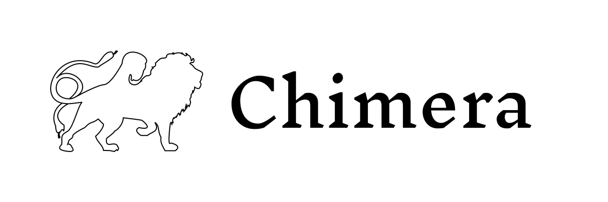

# Chimera Scratch API

**Chimera** lets you sign into your Scratch account through your `session_id` and read/write Cloud Variables.

**Chimera** is lightweight and neatly fits into one Python file.




## Quick Start

To get started, you can load Chimera by executing this code:
```pip
pip install git+https://github.com/38c1/Chimera.git
```
```python
from chimera import chimera
